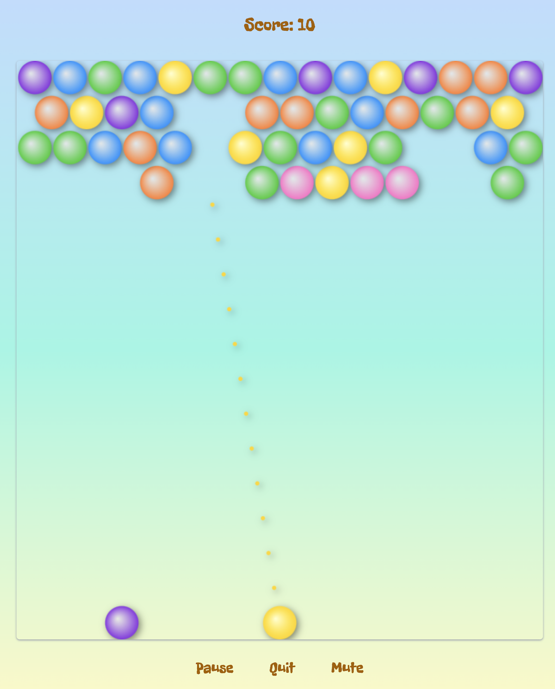

# Bubble Party


_Gameplay Screenshot_

## Description

Bubble Party is a game inspired by the classic arcade game Bubble Shooter and the SpongeBob cartoon. This engaging game allows users to pop bubbles to gain score points. The game starts with a single player, and bubbles of different colors continuously grow from the top of the game area. The player needs to hit bubbles that are adjacent to two or more bubbles of the same color. There are two play modes: relaxed and time-limit.

### Main Features:

- Start and quit the game at any time
- Ability to shoot bubbles
- Accumulative score system
- Three or more adjacent bubbles of the same color create a cluster and drop if one of them is shot
- Game over when the main mass of bubbles reaches the bottom of the game area
- Option to play sound effects or mute them

## Installation

To install and run Bubble Party locally, follow these steps:

1. **Clone the repository**:
   ```sh
   git clone https://github.com/your-username/bubble-party.git
   cd bubble-party
   ```
2. **Install dependencies**:

   ```sh
   npm install
   ```

3. **Start the development server**:

   ```sh
   npm run dev
   ```

4. **Open your browser** and navigate to `http://localhost:3000`

## Usage

### How to Play

- **Shoot Bubbles**: Tap on the game canvas to shoot the shooter bubble in the desired direction. The shooter bubble will stick to the first bubble it hits.
- **Bounce Bubbles**: The shooter bubble will bounce off the walls. You can use this technique to place the shooter in hard-to-reach places.
- **Burst Bubbles**: Connect three or more bubbles of the same color to burst them.
- **Score Points**: Your score increases by the number of bubbles popped each time they burst.
- **Controls**:
  - **Mute**: Toggle sound effects on or off.
  - **Pause**: Pause the game.
  - **Quit**: Quit the game.

Enjoy playing Bubble Party!

## Technologies Used

- Vite
- TypeScript
- TailwindCSS

## Contributing

Contributions are welcome! Please follow these steps to contribute:

1. Fork the repository.
2. Create a new branch (`git checkout -b feature-branch`).
3. Make your changes.
4. Commit your changes (`git commit -m 'Add some feature'`).
5. Push to the branch (`git push origin feature-branch`).
6. Open a pull request.
